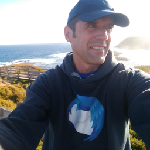

# Thunderbird Council

The Mozilla Thunderbird Council is the elected governing body for the Thunderbird Project. The Council operates much like a board of directors for a company but within the unique context of an open-source project. Just as a board of directors is responsible for overseeing the company's strategic direction, making major decisions, and ensuring the organization's financial health, the Thunderbird Council performs a similar role for the Thunderbird Project. This complements MZLA’s company board by ensuring that MZLA stays true to its open source values and the Mozilla mission.

The Council ensures that Thunderbird remains true to its core values of privacy, freedom, and user empowerment. Established in 2014, the Council acts as the voice of the community, guiding the project's strategic direction and fostering a collaborative environment for all contributors. The Council is composed of seven members and is elected by the Thunderbird community.

The Council typically meets one hour every two weeks. We aim to have at least one in-person meeting per year, which can be attached to a MZLA/Mozilla company event like MozWeek or a meetup around an open source tech conference like [FOSDEM](https://en.wikipedia.org/wiki/FOSDEM).

##  Relationship to Mozilla and MZLA
The Thunderbird project is a part of the Mozilla ecosystem. It is jointly stewarded by the Thunderbird Council and MZLA Technologies.

Both MZLA Technologies Corporation and Mozilla Corporation are subsidiaries of the Mozilla Foundation. The Mozilla Corporation takes care of Firefox and related products, and MZLA takes care of Thunderbird and related projects. MZLA was created following discussions between former councils and the Mozilla Foundation, in order to provide the necessary structure for Thunderbird to operate professionally.

The Council works closely with MZLA to set and adjust the long term strategic direction. Per our [Term Sheet](https://github.com/thunderbird/council-docs/blob/main/TERM_SHEET.md), the Thunderbird Council is responsible for:

* Oversight of the Thunderbird Project
* Oversight of funds and donations
* Developing overall yearly goals
* Approving the yearly project budget
* Collaborate with MZLA on developing the yearly product roadmap
* Providing advice on and approving the yearly staff goals

For more information about the Council, see this [video with Council members Danny and Patrick](https://blog.thunderbird.net/2024/09/video-learn-about-the-thunderbird-council/):
<iframe width="560" height="315" src="https://www.youtube.com/embed/BrovU3MsZzQ?si=5_qEuMdCEMFVX_MW" title="YouTube video player" frameborder="0" referrerpolicy="strict-origin-when-cross-origin" allowfullscreen></iframe>

##  Join the Election Roll
Interested in making a difference in the Thunderbird community? Anyone who has contributed 20 hours to Thunderbird in the past two years is invited to join the Election Roll, which allows them to vote and stand for election. Starting in 2025, the election occurs every two years. Contributors must renew their membership each year in the month of January. Please subscribe to the [Thunderbird Planning mailing list](https://thunderbird.topicbox.com/groups/planning) for the registration announcement.

See the [Election page](election.md) for more information.

##  Get Involved
Contribute to Thunderbird: [Participate - Thunderbird](https://www.thunderbird.net/participate/) Also see: [Codetribute](https://codetribute.mozilla.org/projects/thunderbird)

Discussions and community updates are on the Thunderbird Planning mailing list: [Thunderbird Planning | Topicbox](https://thunderbird.topicbox.com/groups/planning)

Important community announcements, including about the election, are on the Thunderbird Announcements mailing list: [TB Announcements | Topicbox](https://thunderbird.topicbox.com/groups/announcements)

##  Thunderbird Goals
In 2024, the Council created a list our highest priority goals, where there was unanimous agreement from participating members, in order to help guide our decisions and work with MZLA on developing the roadmaps:

1. Declare that a goal of the Thunderbird project is to increase the amount of digitally signed and end-to-end encrypted email exchanged by Thunderbird users on the public Internet
2. Continue to invest in open standards
3. Make end-to-end encryption a cornerstone of all our product and service offerings
4. Increase stability and correctness of the Thunderbird
5. Start a bug bounty program
6. Invest in improvements for chat to become a modern instant messaging application
7. Investigate newer forms of communication

See our [community update](https://thunderbird.topicbox.com/groups/planning/Td85d2de142aee525/thunderbird-council-community-update-2024-h2) for the full list of goals and much more details. During the 2025-2026 term, the Council is planning to use our oversight authority to ensure that MZLA completes all of them in the next few years as intended.

##  Documents
See our  [GitHub repository](https://github.com/thunderbird/council-docs).

##  Contact Us
To contact the entire Council, email: <council@thunderbird.net>

 If you need to contact us privately, please encrypt your message with the  S/MIME certificate or  OpenPGP key listed for each Council member respectively below.

Also see the [Thunderbird modules](https://source-docs.thunderbird.net/en/latest/mots/).

###  Chair
*  
**Philipp Kewisch** (Fallen)  
Founding Council member, MZLA employee, Thunderbird Mobile Manager  
 Email: <kewisch@thunderbird.net> ( [OpenPGP key](https://keys.openpgp.org/search?q=kewisch@thunderbird.net))  
 Matrix: [@kewisch:mozilla.org](https://matrix.to/#/@kewisch:mozilla.org)

###  Secretary
*  
**Patrick Cloke** (clokep)  
Thunderbird Instant Messaging Module Owner  
 Email: <clokep@thunderbird.net>  
 Matrix: [@clokep:matrix.org](https://matrix.to/#/@clokep:matrix.org)  
 Mastodon: <https://mastodon.social/@clokep>

###  Members
*  
**Magnus Melin** (mkmelin)  
Founding Council member, MZLA employee, Thunderbird Desktop Developer  
 Email: <mkmelin@thunderbird.net> ( [OpenPGP key](https://keys.openpgp.org/search?q=mkmelin@thunderbird.net))  
 Matrix: [@mkmelin:mozilla.org](https://matrix.to/#/@mkmelin:mozilla.org)

*  
**Michele Zelco** (micz)  
 Email: <mzelco@thunderbird.net>  
 Matrix: [@micz:mozilla.org](https://matrix.to/#/@micz:mozilla.org)  
 Linkedin: <https://www.linkedin.com/in/mzelco/>

*  
**Tim Maks van den Broek** (mad_maks)  
Localization and SUMO Contributor  
 Email: <tbroek@thunderbird.net>  
 Matrix: [@mad_maks:mozilla.org](https://matrix.to/#/@mad_maks:mozilla.org)

*  
**Teal Dulcet** (tdulcet)  
Computer Scientist and Open Source Software Engineer, Thunderbird Add-on Developer  
 Email: <teal@thunderbird.net> ( [S/MIME certificate](https://kuix.de/smime-keyserver/get.php?email=teal@thunderbird.net),  [OpenPGP key](https://keys.openpgp.org/search?q=teal@thunderbird.net))  
 Matrix: [@tdulcet:matrix.org](https://matrix.to/#/@tdulcet:matrix.org)  
 XMPP: tdulcet@jabber.org  
 Website: [tealdulcet.com](https://tealdulcet.com/)

##  Previous Councils
See the [Members document](https://github.com/thunderbird/council-docs/blob/main/MEMBERS.md) on our GitHub repository. Also see the [Motion History](https://github.com/thunderbird/council-docs/blob/main/MOTIONS.md).

Source 2014 - 2022: The [Thunderbird Wiki](https://wiki.mozilla.org/Thunderbird:Home#Governance).
